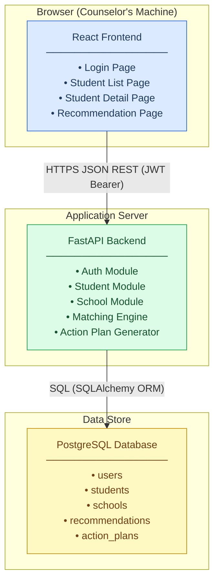

# System Overview
# Intelligent Academic Advisor — MVP
# Document Owner: System Architect
# Date: 2026-03-27
# Status: BASELINE

---

## 1. Component Diagram

**Tier communication rules (REQ-003):**
- The React frontend communicates only with the FastAPI backend over HTTPS using JSON REST. It never queries the database directly.
- The FastAPI backend communicates only with PostgreSQL. It never calls external APIs (REQ-023).
- PostgreSQL is not reachable from the browser or any external network.

---

## 2. Component Responsibilities and Boundaries

### 2.1 React Frontend

**What it owns:**
- All browser-rendered UI: Login page, Student List page, Student Detail page, and Recommendation page (REQ-031, REQ-032, REQ-033, REQ-034).
- User interaction capture: form inputs, "Generate" button trigger (REQ-035).
- JWT token storage in browser memory and attachment to outbound API requests.
- Display of recommendation data: ranked schools, scores, explanations, gaps (REQ-037), and action plan text (REQ-038).
- Client-side routing between pages.

**What it does not own:**
- Business logic (matching, scoring, ranking).
- Persistence or data storage.
- Authentication credential validation.

**Boundary:** The frontend's boundary ends at the HTTP request it sends to `/api/v1/...`. It must not implement any computation that duplicates backend logic.

---

### 2.2 FastAPI Backend

**What it owns:**
- Authentication: credential validation, JWT issuance, token verification on protected routes (REQ-010, REQ-011).
- CRUD endpoints for Student profiles (REQ-012, REQ-013, REQ-014, REQ-015).
- CRUD endpoints for School records.
- Matching Engine: rule-based filtering (REQ-016), scoring (REQ-017, REQ-018), ranking and top-5 selection (REQ-019).
- Recommendation record generation: school name, score, explanation, gaps (REQ-020).
- Action Plan generation: academic targets, extracurricular direction, preparation steps as plain text (REQ-021, REQ-022).
- Enforcement of the no-external-API constraint (REQ-023).
- All application-level business rules and data validation.

**What it does not own:**
- UI rendering or HTML production.
- Raw SQL; all database interaction goes through an ORM layer.
- External network calls of any kind.

**Boundary:** The backend's inbound boundary is the HTTP request received from the frontend. Its outbound boundary is the SQL it sends to PostgreSQL. The matching engine is an internal module; it is not a separate service.

**Extensibility note (REQ-007):** The matching engine and action plan generator are isolated internal modules with clean interfaces. Future ML-based scoring or multi-agent reasoning can replace these modules without altering the HTTP API contracts or database schema.

---

### 2.3 PostgreSQL Database

**What it owns:**
- Durable persistence of all data entities: Users, Students, Schools, Recommendations, ActionPlans (REQ-024, REQ-025, REQ-026, REQ-027).
- Enforcement of relational integrity: one user to many students (REQ-028), one student to many recommendations (REQ-029).
- UUID primary keys on all entities (see ADR-003).
- All data is self-contained; no external data feed is required (REQ-030).

**What it does not own:**
- Business logic or computed fields (computed values are produced by the backend and stored as results).
- Network-accessible endpoints; the database port is accessible only to the backend application process.

**Boundary:** The database's boundary is the connection string. Nothing outside the backend application process may connect to it.

---

## 3. Requirement-to-Component Map

Every requirement from the Master Requirements Register is assigned to exactly one component tier. Cross-domain structural constraints (as identified in pm_req_system_architect.md) are noted.

| REQ-ID | Domain | Component | Summary |
|--------|--------|-----------|---------|
| REQ-001 | ARCH | FRONTEND | Web-based tool; browser is the only client |
| REQ-002 | ARCH | BACKEND | Decision-support constraint enforced at API layer; backend returns data, never acts autonomously |
| REQ-003 | ARCH | ALL | Three-tier topology; each tier's boundary is defined in §2 above |
| REQ-004 | ARCH | FRONTEND | React is the mandated frontend technology |
| REQ-005 | ARCH | BACKEND | FastAPI (Python) is the mandated backend technology |
| REQ-006 | ARCH | DATABASE | PostgreSQL is the mandated database technology |
| REQ-007 | ARCH | BACKEND | Matching engine and action plan generator are isolated modules to support future extension |
| REQ-008 | ARCH | BACKEND | Rule-based logic only; no ML inference layer is present in MVP |
| REQ-009 | ARCH | BACKEND | Each recommendation record contains an explicit explanation field; no opaque scores |
| REQ-010 | BACKEND | BACKEND | Email+password auth implemented as backend auth module |
| REQ-011 | BACKEND | BACKEND | No OAuth, no roles; single-credential model in JWT claims |
| REQ-012 | BACKEND | BACKEND | POST /api/v1/students creates a student profile |
| REQ-013 | BACKEND | BACKEND | PUT /api/v1/students/{id} updates a student profile |
| REQ-014 | BACKEND | BACKEND | GET /api/v1/students/{id} retrieves a student profile |
| REQ-015 | BACKEND | BACKEND | GET /api/v1/students lists all students for the authenticated user |
| REQ-016 | BACKEND | BACKEND | Matching engine step 1: grade-threshold filter |
| REQ-017 | BACKEND | BACKEND | Matching engine step 2: three-factor scoring |
| REQ-018 | BACKEND | BACKEND | Scoring weights are backend constants; no UI for tuning |
| REQ-019 | BACKEND | BACKEND | Matching engine step 3: descending-sort, top-5 selection |
| REQ-020 | BACKEND | BACKEND | Recommendation record built and persisted by backend |
| REQ-021 | BACKEND | BACKEND | Action plan generated by backend action plan module |
| REQ-022 | BACKEND | BACKEND | Action plan output is plain text; no structured scheduling |
| REQ-023 | BACKEND | BACKEND | No outbound HTTP calls; backend is fully self-contained |
| REQ-024 | DATABASE | DATABASE | `users` table persists counselor accounts |
| REQ-025 | DATABASE | DATABASE | `students` table persists student profile fields |
| REQ-026 | DATABASE | DATABASE | `schools` table persists school records |
| REQ-027 | DATABASE | DATABASE | `recommendations` table persists recommendation output |
| REQ-028 | DATABASE | DATABASE | Foreign key: students.user_id → users.id |
| REQ-029 | DATABASE | DATABASE | Foreign key: recommendations.student_id → students.id |
| REQ-030 | DATABASE | DATABASE | Schools table is the sole source; no external feed |
| REQ-031 | FRONTEND | FRONTEND | Login page component |
| REQ-032 | FRONTEND | FRONTEND | Student List page component |
| REQ-033 | FRONTEND | FRONTEND | Student Detail page component with edit form |
| REQ-034 | FRONTEND | FRONTEND | Recommendation page component |
| REQ-035 | FRONTEND | FRONTEND | "Generate" button triggers POST recommendation endpoint |
| REQ-036 | UI | FRONTEND | Clear layout; minimal styling applied in React components |
| REQ-037 | UI | FRONTEND | Recommendation display: name, score, explanation, gaps |
| REQ-038 | UI | FRONTEND | Action plan displayed on Recommendation page |
| REQ-039 | UI | FRONTEND | No animations, no advanced component libraries |
| REQ-040 | INTEGRATION | ALL | End-to-end workflow is achievable via the defined API contracts |
| REQ-041 | INTEGRATION | BACKEND | No WebSocket or pub/sub layer; standard request/response only |
| REQ-042 | INTEGRATION | ALL | Build order: DATABASE → BACKEND → MATCHING → FRONTEND → INTEGRATION |
