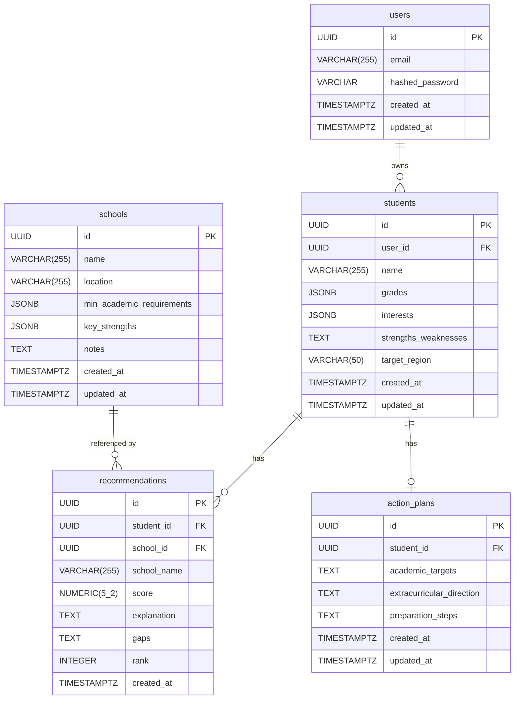

# Schema Specification
# Intelligent Academic Advisor — MVP
# Document Owner: Database Engineer
# Date: 2026-03-27
# Status: BASELINE

---

> **Migration Note:** All migration files in `database/migrations/` are structurally correct Alembic-compatible Python. They require a running PostgreSQL instance (with the `pgcrypto` extension enabled for `gen_random_uuid()`) to execute. Do NOT run `alembic upgrade` until a live database is available and `DATABASE_URL` is set in the environment.

---

## Entity Relationship Diagram

---

## REQ-ID Traceability

| Table | REQ-IDs |
|-------|---------|
| users | REQ-024 |
| students | REQ-025, REQ-028 |
| schools | REQ-026, REQ-030 |
| recommendations | REQ-027, REQ-029 |
| action_plans | REQ-025 (student-owned), REQ-027 (output artifact) |

Architectural constraints observed: REQ-006 (PostgreSQL), REQ-003 (DB accessed only via Backend API), REQ-007 (modular schema), REQ-023 (no external feeds).

---

## Table Definitions

### 1. `users`

**REQ-IDs:** REQ-024

Represents an authenticated counselor account.

| Column | PostgreSQL Type | Nullable | Default | Constraints |
|--------|----------------|----------|---------|-------------|
| `id` | `UUID` | NOT NULL | `gen_random_uuid()` | PRIMARY KEY |
| `email` | `VARCHAR(255)` | NOT NULL | — | UNIQUE |
| `hashed_password` | `VARCHAR` | NOT NULL | — | — |
| `created_at` | `TIMESTAMP WITH TIME ZONE` | NOT NULL | `now()` | — |
| `updated_at` | `TIMESTAMP WITH TIME ZONE` | NOT NULL | `now()` | — |

**Primary Key:** `id`

**Unique Constraints:**
- `uq_users_email` ON `(email)`

**Indexes:**

| Index Name | Columns | Type | Rationale |
|------------|---------|------|-----------|
| `uq_users_email` | `email` | UNIQUE BTREE | Supports `SELECT WHERE email = ?` on login and registration duplicate-check |

**Notes:**
- `hashed_password` is a bcrypt hash. Plaintext passwords are never stored (data_flow.md §3.1).
- `hashed_password` is never returned in any API response (api_contracts.md).

---

### 2. `students`

**REQ-IDs:** REQ-025, REQ-028

Represents a student profile managed by a counselor.

| Column | PostgreSQL Type | Nullable | Default | Constraints |
|--------|----------------|----------|---------|-------------|
| `id` | `UUID` | NOT NULL | `gen_random_uuid()` | PRIMARY KEY |
| `user_id` | `UUID` | NOT NULL | — | FK → `users.id` ON DELETE CASCADE |
| `name` | `VARCHAR(255)` | NOT NULL | — | — |
| `grades` | `JSONB` | NOT NULL | `'{}'::jsonb` | — |
| `interests` | `JSONB` | NOT NULL | `'[]'::jsonb` | — |
| `strengths_weaknesses` | `TEXT` | NOT NULL | `''` | — |
| `target_region` | `VARCHAR(50)` | NOT NULL | — | CHECK (`target_region IN ('local', 'international')`) |
| `created_at` | `TIMESTAMP WITH TIME ZONE` | NOT NULL | `now()` | — |
| `updated_at` | `TIMESTAMP WITH TIME ZONE` | NOT NULL | `now()` | — |

**Primary Key:** `id`

**Foreign Keys:**
- `fk_students_user_id`: `user_id` → `users.id` ON DELETE CASCADE

**Check Constraints:**
- `ck_students_target_region`: `target_region IN ('local', 'international')`

**Indexes:**

| Index Name | Columns | Type | Rationale |
|------------|---------|------|-----------|
| `idx_students_user_id` | `user_id` | BTREE | Supports `SELECT * FROM students WHERE user_id = ?` (GET /students list, REQ-015) |

**Notes:**
- `grades` stores a JSON object mapping subject name (string) to grade value (string). Example: `{"math": "A", "english": "B+"}`.
- `interests` stores a JSON array of interest tag strings. Example: `["robotics", "music"]`.
- `strengths_weaknesses` may be an empty string but not NULL (data_flow.md §1.2).
- `target_region` is constrained to exactly `'local'` or `'international'` (REQ-025).

---

### 3. `schools`

**REQ-IDs:** REQ-026, REQ-030

Represents a school in the system's internal catalog. No external data feeds (REQ-023).

| Column | PostgreSQL Type | Nullable | Default | Constraints |
|--------|----------------|----------|---------|-------------|
| `id` | `UUID` | NOT NULL | `gen_random_uuid()` | PRIMARY KEY |
| `name` | `VARCHAR(255)` | NOT NULL | — | UNIQUE |
| `location` | `VARCHAR(255)` | NOT NULL | — | — |
| `min_academic_requirements` | `JSONB` | NOT NULL | `'{}'::jsonb` | — |
| `key_strengths` | `JSONB` | NOT NULL | `'[]'::jsonb` | — |
| `notes` | `TEXT` | NULL | — | — |
| `created_at` | `TIMESTAMP WITH TIME ZONE` | NOT NULL | `now()` | — |
| `updated_at` | `TIMESTAMP WITH TIME ZONE` | NOT NULL | `now()` | — |

**Primary Key:** `id`

**Unique Constraints:**
- `uq_schools_name` ON `(name)`

**Indexes:**

| Index Name | Columns | Type | Rationale |
|------------|---------|------|-----------|
| `uq_schools_name` | `name` | UNIQUE BTREE | Supports duplicate-check on POST /schools (409 conflict) and name lookups |

**Notes:**
- `min_academic_requirements` stores a JSON object mapping subject to minimum grade. Example: `{"math": "B", "english": "C+"}`.
- `key_strengths` stores a JSON array of strength tag strings. Example: `["STEM", "arts"]`.
- `notes` is nullable; the API accepts an optional field and the matching engine does not use it.
- The matching engine performs a full table scan (`SELECT * FROM schools`) during recommendation generation; no additional index is required for MVP (data_flow.md §3.5).

---

### 4. `recommendations`

**REQ-IDs:** REQ-027, REQ-029

Represents a single matched school result for a student, generated by the matching engine.

| Column | PostgreSQL Type | Nullable | Default | Constraints |
|--------|----------------|----------|---------|-------------|
| `id` | `UUID` | NOT NULL | `gen_random_uuid()` | PRIMARY KEY |
| `student_id` | `UUID` | NOT NULL | — | FK → `students.id` ON DELETE CASCADE |
| `school_id` | `UUID` | NOT NULL | — | FK → `schools.id` (no cascade) |
| `school_name` | `VARCHAR(255)` | NOT NULL | — | — |
| `score` | `NUMERIC(5,2)` | NOT NULL | — | CHECK (`score >= 0 AND score <= 100`) |
| `explanation` | `TEXT` | NOT NULL | — | — |
| `gaps` | `TEXT` | NOT NULL | — | — |
| `rank` | `INTEGER` | NOT NULL | — | CHECK (`rank >= 1 AND rank <= 5`) |
| `created_at` | `TIMESTAMP WITH TIME ZONE` | NOT NULL | `now()` | — |

**Primary Key:** `id`

**Foreign Keys:**
- `fk_recommendations_student_id`: `student_id` → `students.id` ON DELETE CASCADE
- `fk_recommendations_school_id`: `school_id` → `schools.id` (no ON DELETE action — school deletions do not cascade; `school_name` denormalization preserves display integrity per data_flow.md §1.4)

**Unique Constraints:**
- `uq_recommendations_student_rank` ON `(student_id, rank)` — rank is unique per student

**Check Constraints:**
- `ck_recommendations_score`: `score >= 0 AND score <= 100`
- `ck_recommendations_rank`: `rank >= 1 AND rank <= 5`

**Indexes:**

| Index Name | Columns | Type | Rationale |
|------------|---------|------|-----------|
| `idx_recommendations_student_id` | `student_id` | BTREE | Supports `SELECT WHERE student_id = ?` (GET and POST /students/{id}/recommendations) and the DELETE before re-insert pattern |
| `uq_recommendations_student_rank` | `(student_id, rank)` | UNIQUE BTREE | Enforces at-most-one rank value per student; also supports ORDER BY rank queries |

**Notes:**
- `score` is stored as `NUMERIC(5,2)`. The matching engine computes a 0–100 scale (two decimal places). The API contract exposes it as a 0.0–1.0 float; the backend service layer is responsible for converting between these representations.
- `school_name` is a denormalized copy of `schools.name` at the time of generation. This ensures the recommendation record remains displayable even if the school is later deleted (data_flow.md §1.4).
- At most 5 recommendation rows per student are stored at any time (REQ-019). The POST endpoint deletes all existing rows for the student before inserting new ones (data_flow.md §3.5).
- `explanation` and `gaps` are plain-text strings generated by the matching engine, not structured JSON.

---

### 5. `action_plans`

**REQ-IDs:** REQ-025 (student-owned output), REQ-027 (generated artifact)

Represents the action plan generated for a student.

| Column | PostgreSQL Type | Nullable | Default | Constraints |
|--------|----------------|----------|---------|-------------|
| `id` | `UUID` | NOT NULL | `gen_random_uuid()` | PRIMARY KEY |
| `student_id` | `UUID` | NOT NULL | — | FK → `students.id` ON DELETE CASCADE, UNIQUE |
| `academic_targets` | `TEXT` | NOT NULL | — | — |
| `extracurricular_direction` | `TEXT` | NOT NULL | — | — |
| `preparation_steps` | `TEXT` | NOT NULL | — | — |
| `created_at` | `TIMESTAMP WITH TIME ZONE` | NOT NULL | `now()` | — |
| `updated_at` | `TIMESTAMP WITH TIME ZONE` | NOT NULL | `now()` | — |

**Primary Key:** `id`

**Foreign Keys:**
- `fk_action_plans_student_id`: `student_id` → `students.id` ON DELETE CASCADE

**Unique Constraints:**
- `uq_action_plans_student_id` ON `(student_id)` — enforces one action plan per student

**Indexes:**

| Index Name | Columns | Type | Rationale |
|------------|---------|------|-----------|
| `uq_action_plans_student_id` | `student_id` | UNIQUE BTREE | Supports `SELECT WHERE student_id = ?` (GET /students/{id}/action-plan) and enforces the one-plan-per-student constraint for UPSERTs |

**Notes:**
- `academic_targets`, `extracurricular_direction`, and `preparation_steps` are plain-text strings generated by the action plan module.
- Re-generating an action plan performs an UPSERT (INSERT … ON CONFLICT (student_id) DO UPDATE) rather than inserting a new row (data_flow.md §1.5, §3.6).

---

## Schema Decisions and Normalization Notes

The schema is in Third Normal Form (3NF):

1. Every non-key attribute depends on the whole primary key and nothing but the primary key.
2. `school_name` in `recommendations` is a deliberate, documented exception: it is a denormalized snapshot for display integrity when a school record is deleted. This is an intentional design choice consistent with data_flow.md §1.4, not a normalization violation.
3. JSONB columns (`grades`, `interests`, `min_academic_requirements`, `key_strengths`) store structured data whose schema is defined by the application layer. Using JSONB is appropriate here because the set of subjects and strength tags is open-ended and query patterns do not require indexing into these structures for MVP.
4. The schema is designed to accommodate future entities (REQ-007): adding ML score breakdowns, timeline entries, or audit logs does not require modifying any existing table.
