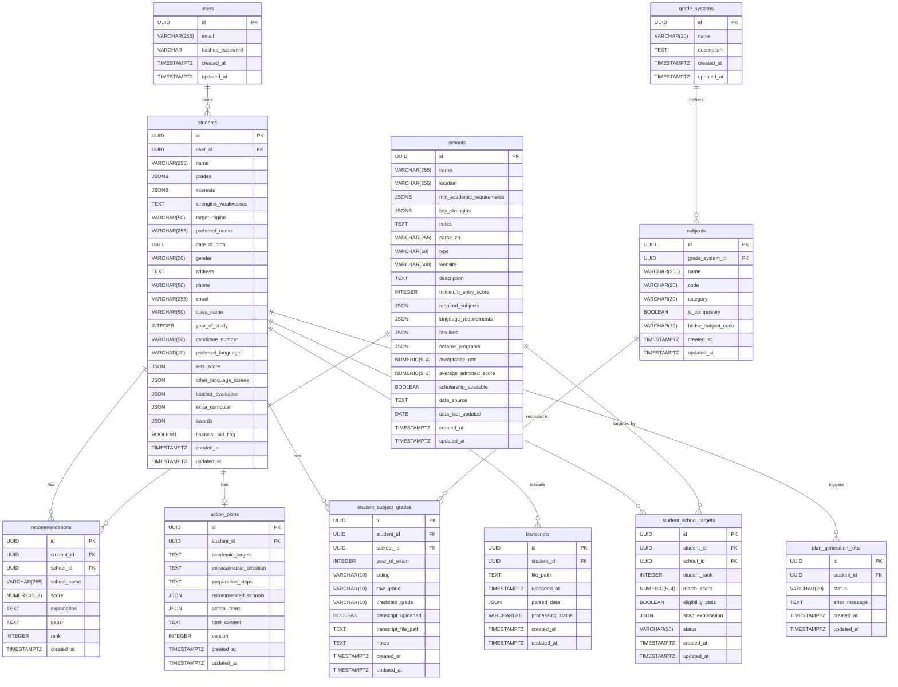

# Schema Specification — v2
# Intelligent Academic Advisor — v2 Pipeline
# Document Owner: Database Engineer
# Date: 2026-03-27
# Status: BASELINE
# Note: This document covers ALL tables (v1 + v2). v1 tables are shown for ERD
#       completeness only; their canonical definitions remain in schema_spec.md.
#       Do not modify schema_spec.md.

---

> **Migration Note:** All migration files in `database/migrations/` are structurally
> correct Alembic-compatible Python. They require a running PostgreSQL instance
> (with the `pgcrypto` extension enabled for `gen_random_uuid()`) to execute.
> Do NOT run `alembic upgrade` until a live database is available and `DATABASE_URL`
> is set in the environment.

---

## Entity Relationship Diagram (v1 + v2)



---

## REQ-ID Traceability

| Table | REQ-IDs |
|-------|---------|
| users | REQ-024 (v1) |
| students | REQ-025, REQ-028 (v1) + REQ-057, REQ-061, REQ-062 (v2 alteration) |
| schools | REQ-026, REQ-030 (v1) + REQ-058, REQ-061, REQ-062 (v2 alteration) |
| recommendations | REQ-027, REQ-029 (v1) |
| action_plans | REQ-025, REQ-027 (v1) + REQ-060, REQ-061, REQ-062 (v2 alteration) |
| grade_systems | REQ-053, REQ-061 |
| subjects | REQ-054, REQ-061, REQ-062 |
| student_subject_grades | REQ-055, REQ-061, REQ-062 |
| transcripts | REQ-056, REQ-061, REQ-062 |
| student_school_targets | REQ-059, REQ-061, REQ-062 |
| plan_generation_jobs | REQ-049, REQ-061, REQ-078 |

---

## New Table Definitions

### 1. `grade_systems`

**REQ-IDs:** REQ-053, REQ-061

Lookup table for the four supported grading frameworks. Seeded at migration time.
All subjects belong to exactly one grade system.

| Column | PostgreSQL Type | Nullable | Default | Constraints |
|--------|----------------|----------|---------|-------------|
| `id` | `UUID` | NOT NULL | `gen_random_uuid()` | PRIMARY KEY |
| `name` | `VARCHAR(20)` | NOT NULL | — | UNIQUE, CHECK (see below) |
| `description` | `TEXT` | NULL | — | — |
| `created_at` | `TIMESTAMP WITH TIME ZONE` | NOT NULL | `now()` | — |
| `updated_at` | `TIMESTAMP WITH TIME ZONE` | NOT NULL | `now()` | — |

**Primary Key:** `id`

**Unique Constraints:**
- `uq_grade_systems_name` ON `(name)`

**Check Constraints:**
- `ck_grade_systems_name`: `name IN ('HKDSE', 'A_LEVEL', 'IB', 'CUSTOM')`

**Indexes:**

| Index Name | Columns | Type | Rationale |
|------------|---------|------|-----------|
| `uq_grade_systems_name` | `name` | UNIQUE BTREE | Fast lookup by name for subject catalog queries |

**Notes:**
- Four rows are inserted at migration time (see seed_data_v2.sql).
- `ON DELETE RESTRICT` is applied to any FK referencing this table (subjects.grade_system_id).
- Using VARCHAR + CHECK rather than a PostgreSQL ENUM type: CHECK constraints are
  easier to extend via ALTER TABLE without a type migration, and the set of four values
  is stable.

---

### 2. `subjects`

**REQ-IDs:** REQ-054, REQ-061, REQ-062

Catalog of subjects for each grade system. The HKDSE subject list is seeded.

| Column | PostgreSQL Type | Nullable | Default | Constraints |
|--------|----------------|----------|---------|-------------|
| `id` | `UUID` | NOT NULL | `gen_random_uuid()` | PRIMARY KEY |
| `grade_system_id` | `UUID` | NOT NULL | — | FK → `grade_systems.id` ON DELETE RESTRICT |
| `name` | `VARCHAR(255)` | NOT NULL | — | — |
| `code` | `VARCHAR(20)` | NOT NULL | — | UNIQUE within grade system (see below) |
| `category` | `VARCHAR(30)` | NOT NULL | — | CHECK (see below) |
| `is_compulsory` | `BOOLEAN` | NOT NULL | `false` | — |
| `hkdse_subject_code` | `VARCHAR(10)` | NULL | — | Official HKDSE code; null for non-HKDSE |
| `created_at` | `TIMESTAMP WITH TIME ZONE` | NOT NULL | `now()` | — |
| `updated_at` | `TIMESTAMP WITH TIME ZONE` | NOT NULL | `now()` | — |

**Primary Key:** `id`

**Foreign Keys:**
- `fk_subjects_grade_system_id`: `grade_system_id` → `grade_systems.id` ON DELETE RESTRICT

**Unique Constraints:**
- `uq_subjects_grade_system_code` ON `(grade_system_id, code)` — code is unique per grade system

**Check Constraints:**
- `ck_subjects_category`: `category IN ('CORE', 'ELECTIVE', 'OTHER_LANGUAGE', 'APPLIED_LEARNING')`

**Indexes:**

| Index Name | Columns | Type | Rationale |
|------------|---------|------|-----------|
| `uq_subjects_grade_system_code` | `(grade_system_id, code)` | UNIQUE BTREE | Duplicate-check on subject upsert; supports subject lookup by code within a grade system |
| `idx_subjects_grade_system_id` | `grade_system_id` | BTREE | Supports `GET /subjects?grade_system_id=X` filter (api_contracts_v2.md) |

**Notes:**
- `is_compulsory = true` for the four HKDSE core subjects: CHLA, ENGL, MATH, CSD.
- Applied Learning subjects use `category = 'APPLIED_LEARNING'`; their grades are
  'Attained' or 'Attained with Distinction' rather than the standard 1–5** scale.

---

### 3. `student_subject_grades`

**REQ-IDs:** REQ-055, REQ-061, REQ-062

One row per student–subject–sitting combination. Multiple rows may exist for the
same student and subject if they have both MOCK and OFFICIAL sittings.

| Column | PostgreSQL Type | Nullable | Default | Constraints |
|--------|----------------|----------|---------|-------------|
| `id` | `UUID` | NOT NULL | `gen_random_uuid()` | PRIMARY KEY |
| `student_id` | `UUID` | NOT NULL | — | FK → `students.id` ON DELETE CASCADE |
| `subject_id` | `UUID` | NOT NULL | — | FK → `subjects.id` ON DELETE RESTRICT |
| `year_of_exam` | `INTEGER` | NULL | — | E.g. 2025 |
| `sitting` | `VARCHAR(10)` | NOT NULL | — | CHECK IN ('MOCK','TRIAL','OFFICIAL') |
| `raw_grade` | `VARCHAR(10)` | NULL | — | Grade string e.g. '5**', '4', 'A' |
| `predicted_grade` | `VARCHAR(10)` | NULL | — | Computed by backend; always null when sitting='OFFICIAL' |
| `transcript_uploaded` | `BOOLEAN` | NOT NULL | `false` | — |
| `transcript_file_path` | `TEXT` | NULL | — | Internal path; not a public URL |
| `notes` | `TEXT` | NULL | — | — |
| `created_at` | `TIMESTAMP WITH TIME ZONE` | NOT NULL | `now()` | — |
| `updated_at` | `TIMESTAMP WITH TIME ZONE` | NOT NULL | `now()` | — |

**Primary Key:** `id`

**Foreign Keys:**
- `fk_ssg_student_id`: `student_id` → `students.id` ON DELETE CASCADE
- `fk_ssg_subject_id`: `subject_id` → `subjects.id` ON DELETE RESTRICT

**Check Constraints:**
- `ck_ssg_sitting`: `sitting IN ('MOCK', 'TRIAL', 'OFFICIAL')`

**Indexes:**

| Index Name | Columns | Type | Rationale |
|------------|---------|------|-----------|
| `idx_ssg_student_id` | `student_id` | BTREE | Primary access pattern: `SELECT * FROM student_subject_grades WHERE student_id = ?` (grade lookup by student, api_contracts_v2.md) |
| `idx_ssg_student_subject` | `(student_id, subject_id)` | BTREE | Supports predicted-grade computation queries that filter by both student and subject |

**Notes:**
- `predicted_grade` is always null when `sitting = 'OFFICIAL'` (enforced in the
  backend service layer, not via a DB constraint, to avoid migration complexity).
- The backend applies the REQ-066 weighting formula (70% latest sitting, 30% teacher
  rating) when writing `predicted_grade`.
- `raw_grade` is nullable at INSERT time; a student may create a grade record before
  they have the actual result.

---

### 4. `transcripts`

**REQ-IDs:** REQ-056, REQ-061, REQ-062

One row per uploaded transcript file. Parsed data is stored as JSON after async
processing. Parsed suggestions are never automatically applied to student_subject_grades
(REQ-067).

| Column | PostgreSQL Type | Nullable | Default | Constraints |
|--------|----------------|----------|---------|-------------|
| `id` | `UUID` | NOT NULL | `gen_random_uuid()` | PRIMARY KEY |
| `student_id` | `UUID` | NOT NULL | — | FK → `students.id` ON DELETE CASCADE |
| `file_path` | `TEXT` | NOT NULL | — | Path relative to UPLOAD_DIR |
| `uploaded_at` | `TIMESTAMP WITH TIME ZONE` | NOT NULL | `now()` | Set at INSERT |
| `parsed_data` | `JSON` | NULL | — | Populated when processing_status='DONE' |
| `processing_status` | `VARCHAR(20)` | NOT NULL | `'PENDING'` | CHECK IN ('PENDING','PROCESSING','DONE','FAILED') |
| `created_at` | `TIMESTAMP WITH TIME ZONE` | NOT NULL | `now()` | — |
| `updated_at` | `TIMESTAMP WITH TIME ZONE` | NOT NULL | `now()` | — |

**Primary Key:** `id`

**Foreign Keys:**
- `fk_transcripts_student_id`: `student_id` → `students.id` ON DELETE CASCADE

**Check Constraints:**
- `ck_transcripts_processing_status`: `processing_status IN ('PENDING', 'PROCESSING', 'DONE', 'FAILED')`

**Indexes:**

| Index Name | Columns | Type | Rationale |
|------------|---------|------|-----------|
| `idx_transcripts_student_id` | `student_id` | BTREE | Supports `GET /students/{id}/transcripts` lookup (api_contracts_v2.md) |

**Notes:**
- `processing_status` values map to the data_flow_v2.md §3.2 states:
  PENDING → PROCESSING → DONE (or FAILED).
- `parsed_data` structure: `{"suggested_grades": [{subject_name, raw_grade}], "parser_confidence": float, "raw_text_excerpt": string}`.
- JSON (not JSONB) is used here for test-environment compatibility; the parsed data is
  read-once and never queried by field path, so binary JSONB indexability is not needed.
  See skills/database-engineer.md for the JSON vs JSONB decision log.

---

### 5. `student_school_targets`

**REQ-IDs:** REQ-059, REQ-061, REQ-062

One row per student–school pairing in the student's target list. Updated in-place
by each match run (UPSERT pattern). Enforces no duplicate school per student.

| Column | PostgreSQL Type | Nullable | Default | Constraints |
|--------|----------------|----------|---------|-------------|
| `id` | `UUID` | NOT NULL | `gen_random_uuid()` | PRIMARY KEY |
| `student_id` | `UUID` | NOT NULL | — | FK → `students.id` ON DELETE CASCADE |
| `school_id` | `UUID` | NOT NULL | — | FK → `schools.id` ON DELETE RESTRICT |
| `student_rank` | `INTEGER` | NULL | — | Student preference order; unique per student |
| `match_score` | `NUMERIC(5,4)` | NULL | — | Combined fit score 0.0000–1.0000; null before first match run |
| `eligibility_pass` | `BOOLEAN` | NULL | — | null before first match run |
| `shap_explanation` | `JSON` | NULL | — | `{top_features: [{feature, value, direction, plain_text}]}` |
| `status` | `VARCHAR(20)` | NOT NULL | `'CONSIDERING'` | CHECK IN ('CONSIDERING','APPLIED','ADMITTED','REJECTED','WITHDRAWN') |
| `created_at` | `TIMESTAMP WITH TIME ZONE` | NOT NULL | `now()` | — |
| `updated_at` | `TIMESTAMP WITH TIME ZONE` | NOT NULL | `now()` | — |

**Primary Key:** `id`

**Foreign Keys:**
- `fk_sst_student_id`: `student_id` → `students.id` ON DELETE CASCADE
- `fk_sst_school_id`: `school_id` → `schools.id` ON DELETE RESTRICT

**Unique Constraints:**
- `uq_sst_student_school` ON `(student_id, school_id)` — no duplicate school per student's target list
- `uq_sst_student_rank` ON `(student_id, student_rank)` — rank is unique per student (partial: where student_rank IS NOT NULL)

**Check Constraints:**
- `ck_sst_status`: `status IN ('CONSIDERING', 'APPLIED', 'ADMITTED', 'REJECTED', 'WITHDRAWN')`

**Indexes:**

| Index Name | Columns | Type | Rationale |
|------------|---------|------|-----------|
| `uq_sst_student_school` | `(student_id, school_id)` | UNIQUE BTREE | Enforces no-duplicate constraint; supports `SELECT WHERE student_id = ? AND school_id = ?` for UPSERT |
| `idx_sst_student_id` | `student_id` | BTREE | Primary access pattern: target list lookup by student (api_contracts_v2.md) |

**Notes:**
- `school_id` uses ON DELETE RESTRICT, not CASCADE: a school row cannot be deleted
  while students are targeting it. This prevents silent data loss in the target list.
- The `uq_sst_student_rank` uniqueness is enforced in application logic with a
  partial unique index (excluding NULLs) to allow multiple null ranks before
  preference ordering is set.

---

### 6. `plan_generation_jobs`

**REQ-IDs:** REQ-049, REQ-061, REQ-078

Job tracking table for the async plan generation pipeline. One row is created per
generation request; the `id` is returned as `job_id` in the 202 response.

| Column | PostgreSQL Type | Nullable | Default | Constraints |
|--------|----------------|----------|---------|-------------|
| `id` | `UUID` | NOT NULL | `gen_random_uuid()` | PRIMARY KEY |
| `student_id` | `UUID` | NOT NULL | — | FK → `students.id` ON DELETE CASCADE |
| `status` | `VARCHAR(20)` | NOT NULL | `'PENDING'` | CHECK IN ('PENDING','RUNNING','DONE','FAILED') |
| `error_message` | `TEXT` | NULL | — | Set on failure |
| `created_at` | `TIMESTAMP WITH TIME ZONE` | NOT NULL | `now()` | — |
| `updated_at` | `TIMESTAMP WITH TIME ZONE` | NOT NULL | `now()` | — |

**Primary Key:** `id`

**Foreign Keys:**
- `fk_pgj_student_id`: `student_id` → `students.id` ON DELETE CASCADE

**Check Constraints:**
- `ck_pgj_status`: `status IN ('PENDING', 'RUNNING', 'DONE', 'FAILED')`

**Indexes:**

| Index Name | Columns | Type | Rationale |
|------------|---------|------|-----------|
| `idx_pgj_student_id` | `student_id` | BTREE | Supports job history lookup by student; supports polling queries `WHERE student_id = ? ORDER BY created_at DESC` |

**Notes:**
- Jobs are never deleted; they form an audit trail of generation requests.
- The `status` enum uses uppercase values consistent with the other new tables.
  Note: data_flow_v2.md §1.10 uses lowercase (`pending`, `running`, `complete`,
  `failed`) — the backend service layer normalises to uppercase on write and
  lowercases on read if required by the API contract.

---

## Altered Table Definitions

### `students` — ALTER TABLE (v2 additions)

**REQ-IDs:** REQ-057, REQ-061

All new columns are nullable (no NOT NULL without a default) to preserve backward
compatibility with existing v1 rows that predate this migration.

```sql
ALTER TABLE students
    ADD COLUMN IF NOT EXISTS preferred_name      VARCHAR(255),
    ADD COLUMN IF NOT EXISTS date_of_birth       DATE,
    ADD COLUMN IF NOT EXISTS gender              VARCHAR(20),
    ADD COLUMN IF NOT EXISTS address             TEXT,
    ADD COLUMN IF NOT EXISTS phone               VARCHAR(50),
    ADD COLUMN IF NOT EXISTS email               VARCHAR(255),
    ADD COLUMN IF NOT EXISTS class_name          VARCHAR(50),
    ADD COLUMN IF NOT EXISTS year_of_study       INTEGER,
    ADD COLUMN IF NOT EXISTS candidate_number    VARCHAR(50),
    ADD COLUMN IF NOT EXISTS preferred_language  VARCHAR(10) DEFAULT 'en',
    ADD COLUMN IF NOT EXISTS ielts_score         JSON,
    ADD COLUMN IF NOT EXISTS other_language_scores JSON,
    ADD COLUMN IF NOT EXISTS teacher_evaluation  JSON,
    ADD COLUMN IF NOT EXISTS extra_curricular    JSON,
    ADD COLUMN IF NOT EXISTS awards              JSON,
    ADD COLUMN IF NOT EXISTS financial_aid_flag  BOOLEAN DEFAULT false;
```

**Preserved v1 columns (unchanged):** `id`, `user_id`, `name`, `grades`, `interests`,
`strengths_weaknesses`, `target_region`, `created_at`, `updated_at`.

**Notes:**
- `ielts_score` is stored as JSON to capture the full score object
  `{overall, listening, reading, writing, speaking, test_date}` rather than scalar
  columns. This consolidates the data_flow_v2.md §1.2 ielts_* fields into one column.
- PII fields (`date_of_birth`, `address`, `phone`) are marked for encryption at rest
  per ADR-008; the column type remains TEXT/DATE at the DB level.
- `preferred_language` default `'en'` matches the v1 `users.preferred_language`
  convention.

---

### `schools` — ALTER TABLE (v2 additions)

**REQ-IDs:** REQ-058, REQ-061

```sql
ALTER TABLE schools
    ADD COLUMN IF NOT EXISTS name_zh               VARCHAR(255),
    ADD COLUMN IF NOT EXISTS type                  VARCHAR(30) NOT NULL DEFAULT 'UNIVERSITY'
                                                       CHECK (type IN ('UNIVERSITY','POLYTECHNIC','COMMUNITY_COLLEGE','VOCATIONAL')),
    ADD COLUMN IF NOT EXISTS website               VARCHAR(500),
    ADD COLUMN IF NOT EXISTS description           TEXT,
    ADD COLUMN IF NOT EXISTS minimum_entry_score   INTEGER,
    ADD COLUMN IF NOT EXISTS required_subjects     JSON,
    ADD COLUMN IF NOT EXISTS language_requirements JSON,
    ADD COLUMN IF NOT EXISTS faculties             JSON,
    ADD COLUMN IF NOT EXISTS notable_programs      JSON,
    ADD COLUMN IF NOT EXISTS acceptance_rate       NUMERIC(5,4),
    ADD COLUMN IF NOT EXISTS average_admitted_score NUMERIC(5,2),
    ADD COLUMN IF NOT EXISTS scholarship_available BOOLEAN DEFAULT false,
    ADD COLUMN IF NOT EXISTS data_source           TEXT,
    ADD COLUMN IF NOT EXISTS data_last_updated     DATE;
```

**Preserved v1 columns (unchanged):** `id`, `name`, `location`, `min_academic_requirements`,
`key_strengths`, `notes`, `created_at`, `updated_at`.

**Notes:**
- `type` has NOT NULL DEFAULT 'UNIVERSITY' so existing rows get a valid value without
  requiring a backfill step before the constraint is applied.
- `acceptance_rate` is NUMERIC(5,4): stores 0.0000–1.0000 (e.g. 0.1234 = 12.34%).
- `average_admitted_score` is NUMERIC(5,2): stores JUPAS aggregate scores (e.g. 22.50).

**Indexes added for school search patterns (api_contracts_v2.md School Directory):**

```sql
CREATE INDEX IF NOT EXISTS idx_schools_type     ON schools (type);
CREATE INDEX IF NOT EXISTS idx_schools_location ON schools (location);
CREATE INDEX IF NOT EXISTS idx_schools_name_trgm ON schools USING gin (name gin_trgm_ops);
```

Note: `idx_schools_name_trgm` requires the `pg_trgm` extension. If unavailable,
a plain BTREE on `name` suffices for exact-match; trigram is for ILIKE search.

---

### `action_plans` — ALTER TABLE (v2 additions)

**REQ-IDs:** REQ-060, REQ-061

```sql
ALTER TABLE action_plans
    ADD COLUMN IF NOT EXISTS recommended_schools JSON,
    ADD COLUMN IF NOT EXISTS action_items        JSON,
    ADD COLUMN IF NOT EXISTS html_content        TEXT,
    ADD COLUMN IF NOT EXISTS version             INTEGER NOT NULL DEFAULT 1;
```

**Preserved v1 columns (unchanged):** `id`, `student_id`, `academic_targets`,
`extracurricular_direction`, `preparation_steps`, `created_at`, `updated_at`.

**Notes:**
- `version` starts at 1 for all existing rows (handled by NOT NULL DEFAULT 1).
- `recommended_schools` structure: `[{school_id, school_name, rationale}]`.
- `action_items` structure: `[{task, deadline, related_school_id, priority}]`.
- `html_content` is null until the first plan generation completes.

---

## Index Summary (v2 additions)

All indexes supporting the query patterns in api_contracts_v2.md:

| Index Name | Table | Columns | Purpose |
|------------|-------|---------|---------|
| `idx_subjects_grade_system_id` | subjects | `grade_system_id` | Subject list filtered by grade system |
| `idx_ssg_student_id` | student_subject_grades | `student_id` | Grade lookup by student |
| `idx_ssg_student_subject` | student_subject_grades | `(student_id, subject_id)` | Grade lookup by student + subject |
| `idx_transcripts_student_id` | transcripts | `student_id` | Transcript list by student |
| `idx_sst_student_id` | student_school_targets | `student_id` | Target list by student |
| `uq_sst_student_school` | student_school_targets | `(student_id, school_id)` | UPSERT conflict target; no-duplicate enforcement |
| `idx_pgj_student_id` | plan_generation_jobs | `student_id` | Job status polling by student |
| `idx_schools_type` | schools | `type` | School directory filter by type |
| `idx_schools_location` | schools | `location` | School directory filter by location |

---

## Schema Decision Notes

1. **CHECK constraints vs PostgreSQL ENUM types:** All enum-like columns use
   `VARCHAR + CHECK IN (...)`. This avoids `ALTER TYPE` migrations when values need
   to be extended and is compatible with SQLite-backed test environments.

2. **JSON vs JSONB:** New variable-structure columns use JSON (not JSONB) for test
   compatibility with SQLite. The v1 schema uses JSONB for `grades`, `interests`,
   `min_academic_requirements`, `key_strengths` — those are unchanged. In production
   PostgreSQL, JSON and JSONB are functionally equivalent for read/write; the
   difference is GIN indexability (JSONB only). None of the new JSON columns have
   query patterns requiring GIN indexing in v2.

3. **ON DELETE semantics:** CASCADE for student-owned data (grades, transcripts,
   targets, jobs). RESTRICT for reference data (subjects, schools) — prevents
   accidental data loss when a catalog row has dependents.

4. **Additive-only migration:** No v1 column is removed or renamed. All new columns
   on existing tables are nullable or have a DEFAULT, ensuring zero-downtime
   deployment onto a live v1 database.
